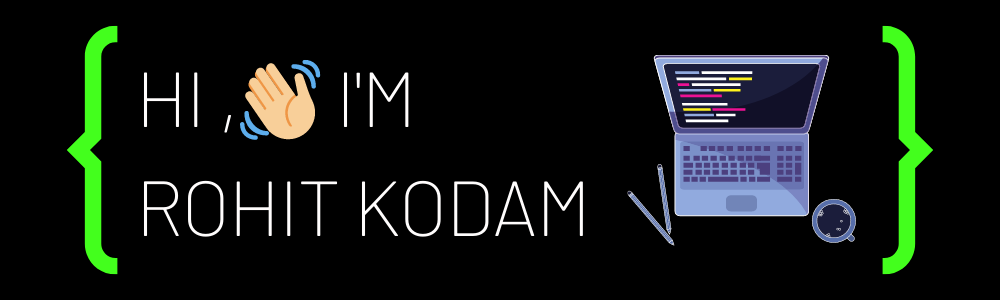
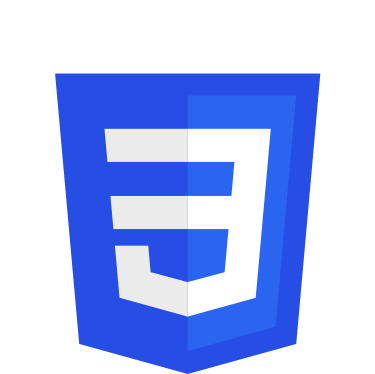

 

  

 

## 📖 About me

-   💻 Working on **my React, Express and Node skills**

-   🌱 Learning **NoSQL databases**

-   🎓 **Msc. Economics Student** at BITS Goa

-   💻 I enjoy watching **Anime**

<!-- -   ⚡ Fun fact  -->

## 📫 Connect with me

  
	
	

  
  
## 💻 Technologies and Tools

 
	<code>  </code>
	<code>   </code>
	<code>  </code>
	<code>  </code>
	<code>  </code>

  
  
## 📈 Github Stats

<!-- https://github.com/anuraghazra/github-readme-stats -->

  
📊 GitHub Profile Stats

   
  

 
  
💻 Most used languages

   
  
   
  <b>Note:</b> This chart is only a metric of which languages my public code on GitHub consists of and does not reflect my experience or skill level.

  
⚡GitHub Streak

   
  

<!-- Here are some ideas to get you started:

- 🔭 I’m currently working on ...
- 🌱 I’m currently learning ...
- 👯 I’m looking to collaborate on ...
- 🤔 I’m looking for help with ...
- 💬 Ask me about ...
- 📫 How to reach me: ...
- 😄 Pronouns: ...
- ⚡ Fun fact: ... -->
