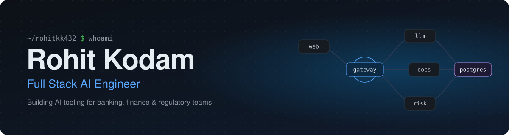
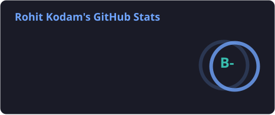
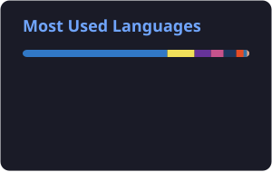

<!-- ============ HEADER ============ -->

  

  
  &nbsp;
  
  &nbsp;
  
   
  

## 👨‍💻 About me

I build full stack AI products, from backend systems to the interfaces on top of them. Currently working on AI tooling for banking, financial services and regulatory teams, and growing toward distributed systems at scale.

### 💼 Experience

<table>
  <tr>
    <td width="84" align="center">
      
    </td>
    <td>
      <b>Full Stack AI SDE</b> 
      <a href="https://www.linkedin.com/company/ONFINANCE_SLUG/"><b>OnFinance</b></a> 
      Sept 2026 – Present · AI tooling for BFSI &amp; RegTech
    </td>
  </tr>
  <tr>
    <td width="84" align="center">
      
    </td>
    <td>
      <b>SDE 1</b> 
      <a href="https://www.linkedin.com/company/TMRW_SLUG/"><b>TMRW House of Brands</b></a> 
      July 2024 – Aug 2026 · Backend for a multi-tenant D2C platform
    </td>
  </tr>
</table>

### 🎓 Education

<table>
  <tr>
    <td width="84" align="center">
      
    </td>
    <td>
      <b>Economics &amp; Computer Science</b> 
      <a href="https://www.linkedin.com/school/BITS_SLUG/"><b>BITS Pilani, K K Birla Goa Campus</b></a>
    </td>
  </tr>
</table>

## 💻 Technologies and Tools

### Languages

### Full-Stack WebDev

### Other DevTools

## 📈 GitHub stats

  
  

  

Language chart reflects public repos only, not overall experience.
